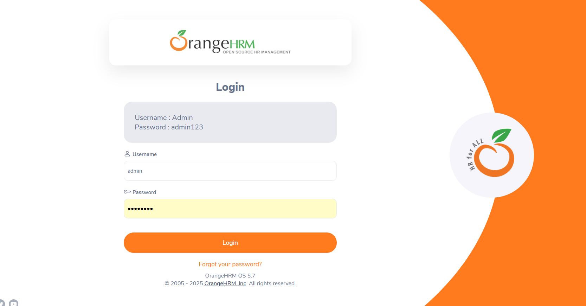

# DEF-005 – Username is case-insensitive (clarification needed)
Severity: Low • Priority: Medium  
Environment: Windows 11, Firefox

**Steps**  
Username: `admin` (lowercase) • Password: `admin123` → Login.

**Expected**  
If usernames are case-sensitive, show “Invalid credentials”.

**Actual**  
Login succeeds with lowercase `admin`.

**Evidence**  

**Notes**  
If requirement is case-insensitive, convert this to a *clarification* (no defect).
