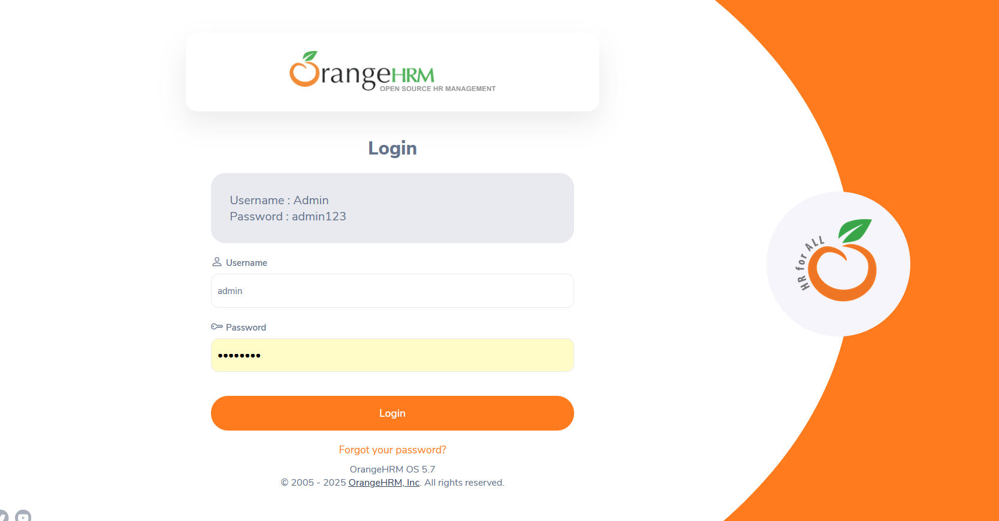
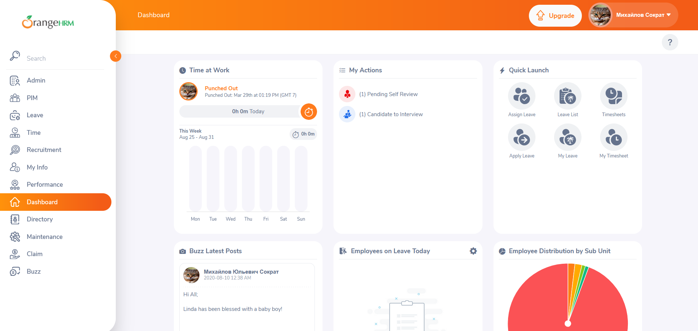

# OrangeHRM – Login Test Cases (Manual) - EP, BVA, USABILITY T, STATE TRANSTITION T AND UX/security	TESTING 

TC-001 – Valid login (happy path)		PASS		
Technique: EP (positive)				
Steps: Type Admin / admin123 → click Login.				
Expected: You see the dashboard (URL has /dashboard or user menu appears).				
				
TC-002 – Empty username		FAIL 		
Technique: Required/BVA				
Steps: Leave username blank; type any password → Login.				
Expected: “Required” under username; you stay on login.				
				
TC-003 – Empty password		FAIL		
Technique: Required/BVA				
Steps: Type any username; leave password blank → Login.				
Expected: “Required” under password; you stay on login.				
				
TC-004 – Wrong password		FAIL 		
Technique: EP (negative)				
Steps: Admin / wrongpass → Login.				
Expected: “Invalid credentials”; you stay on login.				
				
TC-005 – Username wrong case		FAIL	 	
Technique: EP (case sensitivity)				
Steps: admin (lowercase) / admin123 → Login.				
Expected: “Invalid credentials”; you stay on login.				
Actual: "valid credentials", you see the dashbard				

Evidence:  

				
TC-006 – Password wrong case				
Technique: EP (case) [ES: Partición de Equivalencia – sensibilidad a mayúsculas]				
Steps: Admin / ADMIN123 → Login.				
Expected: “Invalid credentials”; stay on login.				
Actual: “Invalid credentials”; you stay on login.				
				
				
				
TC-007 – Username with leading/trailing spaces			FAIL	
Technique: EP (whitespace) [ES: espacios]				
Steps: ␠Admin␠ / admin123 → Login.				
Expected: App trims or rejects consistently; no crash. Record actual.				
Actual: “Invalid credentials”; you stay on login.				
				
				
TC-008 – Both fields empty				
Technique: BVA/Required [ES: Análisis de Fronteras / obligatorio]				FAIL
Steps: Username blank; Password blank → Login.				
Expected: “Required” under both fields; stay on login.				
Actual: "Creddential required" you stay on login				
				
				
TC-009 – Password too short (7)		FAIL		
Technique: BVA (lower)				
Steps: Admin / admin12 → Login.				
Expected: “Invalid credentials”; stay on login.				
Actual: “Invalid credentials”; you stay on login.				
				
				
TC-010 – Password too long (9)		FAIL		
Technique: BVA (upper-near)				  
Steps: Admin / admin1234 → Login.				
Expected: “Invalid credentials”; stay on login.				
Actual: “Invalid credentials”; you stay on login.				
				
				
TC-011 – Username very long (≥255)			FAIL	
Technique: BVA (upper/robustness)				
Steps: Paste 255+ chars in Username; any password → Login.				
Expected: Field blocks extra or shows error; app stable; stay on login.				
Actual: “Invalid credentials”; you stay on login.				
				
				
TC-012 – Press Enter submits		PASS		
Technique: Usability sanity				
Steps: Fill Admin / admin123 → press Enter.				
Expected: Same as clicking Login; dashboard appears.				
Actual: Same as clicking Login; dashboar appears.				
				
				
TC-013 – SQL/JS injection string in username			FAIL	
Technique: EP (negative/security)				
Steps: Username " or 1=1 -- ; any password → Login.				
Expected: Generic invalid error; no crash.				
Actual: “Invalid credentials”; you stay on login.				
				
				
TC-014 – Logout prevents back navigation			FAIL	
Technique: State transition [ES: transición de estados]				
Steps: Login → open user menu → Logout → press browser Back.				
Expected: Remain on login; dashboard not accessible.				
Actual: move to the user menu, dashboar is accesible 				
				
				
TC-015 – Password field masking		PASS		
Technique: UX/security				
Steps: Type in Password field and observe.				
Expected: Characters are masked (•); visibility toggle (if present) works				
Actual: character are actually masked, visibility is not present 				
Note: Suggestion, add/hide toggle to reduce typos (not a defect).				
